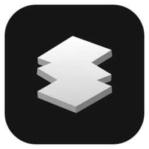
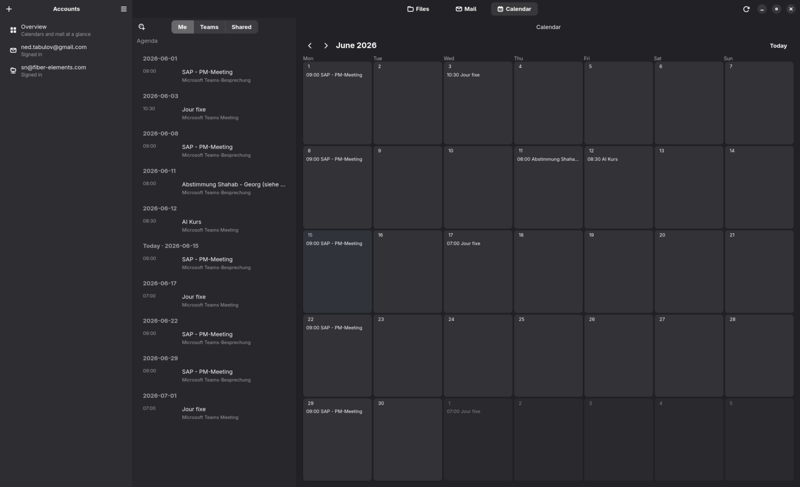
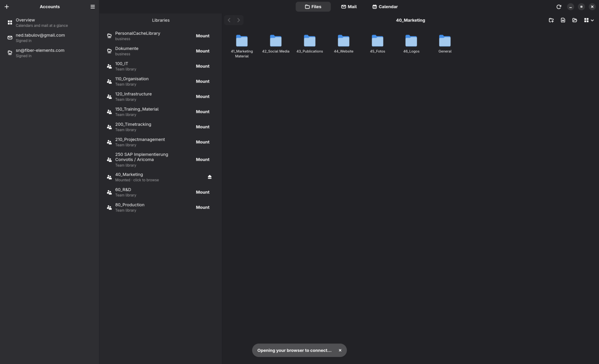
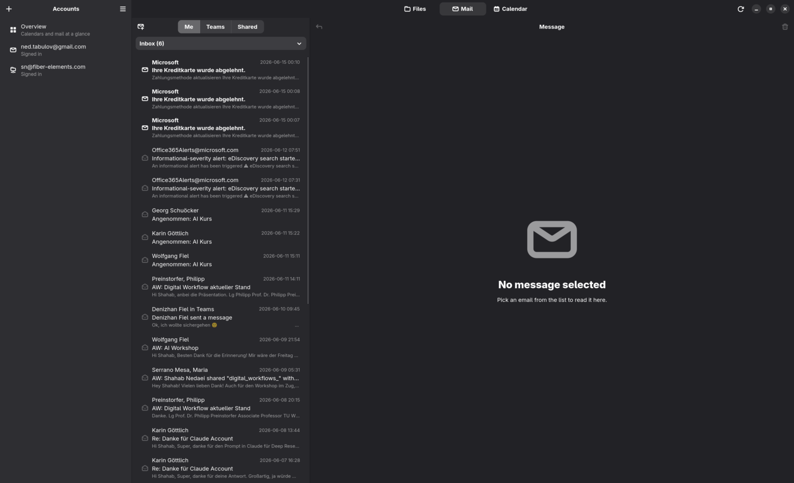
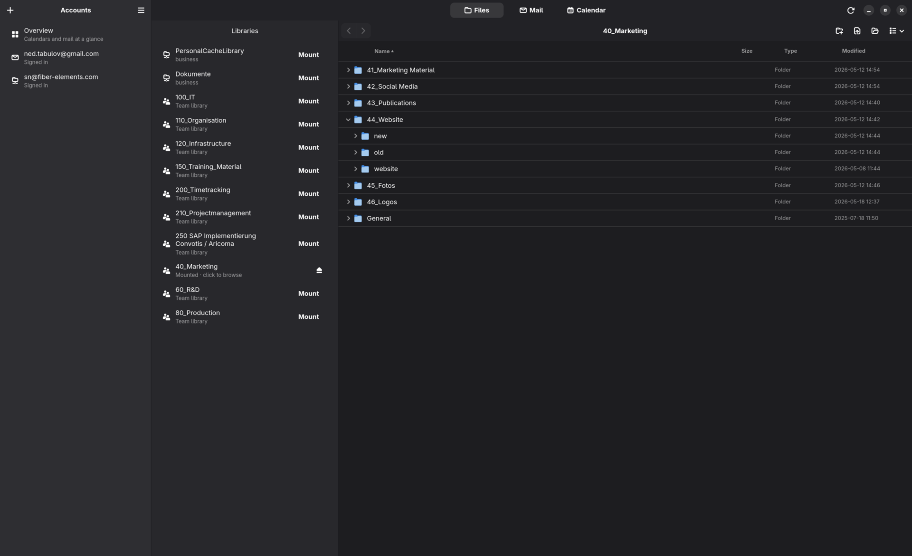

<!--
SPDX-License-Identifier: GPL-3.0-or-later
SPDX-FileCopyrightText: 2026 Shahab Nedaei
-->

<div align="center">



# Cloudy

**Microsoft 365 and Google — OneDrive, SharePoint, mail and calendar — in one GNOME-native window.**

[](COPYING)


[**Website**](https://sha5b.github.io/Cloudy/) · [**Download**](https://github.com/sha5b/Cloudy/releases) · [Privacy](https://sha5b.github.io/Cloudy/privacy.html) · [Terms](https://sha5b.github.io/Cloudy/terms.html)

</div>

---

A native **GTK4 / Libadwaita** super-app for Fedora that brings **Microsoft 365**
(OneDrive + Teams/SharePoint, Mail, Calendar, Chat, Teams channels + OneNote) and
**Google** (Gmail, Calendar, Drive, Chat) into one window — with file-manager
(Nautilus) integration, live network-drive mounts, and a unified,
provider-agnostic **mail + calendar + chat** surface.

Cloudy does **not** reinvent sync engines. It *orchestrates* proven backends —
`rclone` for the FUSE file mounts, and **Microsoft Graph** / **Google REST** for
mail, calendar & chat — behind one adaptive UI.

## Screenshots

| Calendar | Files |
|---|---|
|  |  |

| Mail | In-app browser |
|---|---|
|  |  |

## Features

- **Microsoft 365** (OneDrive + Teams/SharePoint libraries) and **Google**
  (Gmail, Calendar, My Drive) accounts side by side.
- **Files** as live `rclone` FUSE mounts — two-way network drives that appear in
  GNOME Files and an in-app browser (not synced copies), with right-click
  OneDrive / SharePoint share links and optional offline sync.
- **Mail**: read (HTML), compose, reply/reply-all, with **Me / Teams / Shared**
  mailbox sources and contacts autocomplete.
- **Calendar**: month grid + agenda, event detail with an attendee response
  tracker, and **create / edit / delete** events + RSVP.
- **Chat**: a Teams-style messenger for **Teams chats** (work/school Microsoft
  accounts) and **Google Chat** (Workspace) — 1:1, group and meeting threads,
  inline images (attach or paste), emoji reactions, @mentions, reply/forward
  (with **clickable reply quotes** that jump to the original message),
  edit/delete, multi-select, group create + member management, a **live list**
  that floats new conversations to the top, presence dots, and message search.
- **Teams** (Microsoft work/school): pick a **team** to browse its **channels**,
  then read a channel's **posts** with threaded replies (and post / reply), or
  open its **Notes** tab — the team's **OneNote** notebook, with sections and
  pages you can read (text + inline images) and **create or edit**.
- **Dashboard**: an at-a-glance overview across every account — upcoming events,
  recent mail, file changes, pinned mailboxes/calendars, and an **Activity** feed
  of recent **chats** and the latest posts in **channels you star** (★ in the
  Chat / Teams headers).
- **Desktop integration**: system `mailto:` / `.ics` handler, new-mail/event
  notifications, and a Nautilus extension for status emblems.
- **Secrets** stored via **libsecret** — never plaintext. No telemetry; the
  committed repo ships zero credentials.

## Install

Built and tested for **Fedora 44 (GNOME 50)**.

```bash
# Flatpak (single-file bundle from a release):
flatpak install --user ./io.github.sha5b.Cloudy.flatpak

# RPM:
sudo dnf install ./cloudy-*.noarch.rpm
```

See the [releases page](https://github.com/sha5b/Cloudy/releases).

## Build from source

```bash
# 1. Install everything (toolchain + host backends + Flatpak runtime):
make bootstrap

# 2a. Build, install, and run locally:
make run

# 2b. …or build a sandboxed Flatpak:
make flatpak flatpak-run

# 2c. …or build distributable artifacts (RPM + .flatpak) into release/:
make release
```

Common targets: `make build`, `make test`, `make lint`, `make clean`. Dev
toolchain is user-space (`meson`/`ninja` via `pip --user`). OAuth client IDs are
baked at build time or supplied via `.env` — see [docs/SECRETS.md](docs/SECRETS.md).

## Documentation

- [docs/HANDOFF.md](docs/HANDOFF.md) — current status, gotchas, backlog
- [docs/ARCHITECTURE.md](docs/ARCHITECTURE.md) · [docs/AUTH.md](docs/AUTH.md) · [docs/SECRETS.md](docs/SECRETS.md) · [docs/BUILDING.md](docs/BUILDING.md) · [docs/MODULES.md](docs/MODULES.md) · [docs/ROADMAP.md](docs/ROADMAP.md)

## Legal

- [Privacy Policy](https://sha5b.github.io/Cloudy/privacy.html) · [Terms of Service](https://sha5b.github.io/Cloudy/terms.html)
- Licensed under the **GNU General Public License v3.0 or later** — see [COPYING](COPYING). Each source file carries an SPDX identifier.
- Cloudy is an independent project, **not affiliated with Microsoft or Google**. All trademarks belong to their respective owners.

## Contributing

See [CONTRIBUTING.md](CONTRIBUTING.md) and [CODE_OF_CONDUCT.md](CODE_OF_CONDUCT.md).
